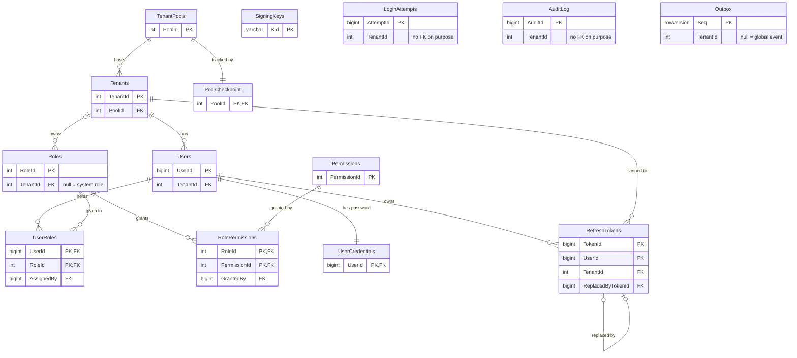

# Identity database: tables and relationships

```mermaid
erDiagram
    TenantPools ||--o{ Tenants : hosts
    Tenants ||--o{ Users : has

    TenantPools {
        int PoolId PK
    }
    Tenants {
        int TenantId PK
        int PoolId FK
    }
    Users {
        bigint UserId PK
        int TenantId FK
    }

    Tenants |o--o{ Roles : owns
    Users ||--o{ UserRoles : holds
    Roles ||--o{ UserRoles : "given to"

    Roles {
        int RoleId PK
        int TenantId FK "null = system role"
    }

    UserRoles {
        bigint UserId PK, FK
        int RoleId PK, FK
        bigint AssignedBy FK
    }

    Roles ||--o{ RolePermissions : grants
    Permissions ||--o{ RolePermissions : "granted by"

    Permissions {
        int PermissionId PK
    }
    RolePermissions {
        int RoleId PK, FK
        int PermissionId PK, FK
        bigint GrantedBy FK
    }

    Users ||--|| UserCredentials : "has password"
    Users ||--o{ RefreshTokens : owns
    Tenants ||--o{ RefreshTokens : "scoped to"
    RefreshTokens |o--o| RefreshTokens : "replaced by"

    UserCredentials {
        bigint UserId PK, FK
    }
    RefreshTokens {
        bigint TokenId PK
        bigint UserId FK
        int TenantId FK
        bigint ReplacedByTokenId FK
    }

    TenantPools ||--|| PoolCheckpoint : "tracked by"

    PoolCheckpoint {
        int PoolId PK, FK
    }
    SigningKeys {
        varchar Kid PK
    }
    LoginAttempts {
        bigint AttemptId PK
        int TenantId "no FK on purpose"
    }
    AuditLog {
        bigint AuditId PK
        int TenantId "no FK on purpose"
    }
    Outbox {
        rowversion Seq PK
        int TenantId "null = global event"
    }
```